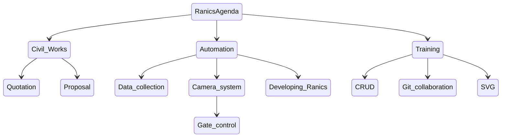

# Ranics

This is a system that will aid in carrying out daily carpack activities in mutall
carpark.

## The Systems Objectives

### Main objectives

1. Provide carpack services.

### Other objectives

1. Help us learn the basic data operations.
2. Aid us in collaborating in programming the system.
3. Be able to write a proposal.
4. Do advanced data management

## **Ranics in Relation to CRUD** 

  > C - Create  
  > R - Review  
  > U - Update  
  > D - Delete  

CRUD shows the steps in which data operations occur. The language used is
Structured Query Language (SQL).

`CREATE`

 Data can be created through various ways such as:

- Forms.
- Images.
- Voice Recording.
- Data logger.

 `REVIEW`

This is the act of interrogating data for use.

 `UPDATE`

This includes adding of additional data to an existing data structure or
modifying data after reviewing.

`DELETE`

The act of removing data from a structure.

**SQL Statements and Their Functions**

> Create data - INSERT.  
> Review - SELECT.  
> Update - UPDATE.  
> Delete - DELETE.  

**Additional Statements**

> ALTER -Changes the data structure.  
> CREATE - Creates the data structure.

## Ranics Agenda

Ranics has 7 agenda items which are crucial to the CRUD module.

|   Civil Works   |  Automation    | Training     |
| ---- | ---- | ---- |
|  1. Quotations    |  3. Data collection    |  6. CRUD    |
| 2. Proposal     |  4. Camera system    | 7. Git Collaboration    |
|  |   5. Developing Ranics    | 8. SVG |

### Civil Works

##### Quotations

Compare three different quotations from different vendors. For price evaluation and review. Learn how to (JN)

##### Proposal  

Write a proposal of the system for funding request. (DK)

### Automation

##### Data collection  

Collect data for a month for effective review and learning how to manipulate data. (PK)

##### Camera systems

Research and present on how to use a camera system for the carpark. And also find out how the automated carparks operate by visiting three different carparks, how they are installed and implemented, also the modes of payment.(SW)  
How the gate control system works.

Research on how to get data from the NTSA database system.(JN)

##### Developing Ranics

Develop Ranics actual software;

- Design a data model.(FN)  
- Implement the data model.

### Training

##### CRUD

- Collect data
- Learn how to review
- Data collected will help determine how long it will take for the spent money to be recovered.
  
##### Git Collaboration

Learn how to use git to work together on the Ranics project.

- Install Github Desktop.
- Demo on using git for collaboration(PM)
- Understanding the git terminologies.
  
### ASSIGNMENTS

**completed**
___
- [x] Design a database for Ranics carpark.(PK)
- [x] Fix the navigation bar.(JN)
- [x] Style Ranics and reduce the styling to a minimum.(SW)
- [x] Restructure the forms to save the data entered to a database.(DK)
- [x] Research on how to use git to collaborate on Ranics.(PK)
- [x] Use the basic form of saving data to the database rather than the database class.(DK)
- [x] Migrate the json file data to the database.(PK)

###### `Quotations`
`07-03-2022`

- [x] 1. Combine the quotations to use standard terms. (JN)
- [x] 2. Get the accurate measurement of the carpark area. (JN)
- [x] 3. Read about the bill of quantity. (ALL)
___
###### `Proposal`
`28-02-2022`

- [ ] 1. Consult Mrs. Muraya. Involve her in the process. (DK)
- [x] 2. Find a Quantity Surveyor(QS). (DK)
- [ ] 3. Research on documents needed when writing and submiting the proposal. (DK)
- [ ] 4. Collect the required permits and documents. (DK)
- [ ] 5. Estimate the cars expected. (DK)
- [ ] 6. Estimate the cash for quotations and determine how long it will take to repay. (DK)
- [ ] 7. Have an architectural drawing of the carpark in aerial view. (DK)

`07-03-2022`

- [x] 4. Show a draft of the proposal in the next session. (DK) 

###### **`Training`**
`28-02-2022`

- [x] 8. Flow data collection *involve elias* (PK)

- [x] 9. Stock data - divide among the members to collect the data in under 15 minutes. (PK)

- [x] 10. Review data using Access. (PM)

- [x] 11. Research what is required to interrogate the remote database locally. (PK)

`07-03-2022`

- [x] 5. Transfer the ranics database to our local machines (ALL)

- [x] 6. Install the ranics database on Mr Muraya's laptop. (JN)
###### **`Automation`**

- [x] 12. Design a model for the Carpark. (FN)

**QUESTIONS**

___
- How many cars can be potentially be clients.  

- How long a car stays.  

- Who are the owners.

- List all clients visit them and find out the cars they bring to the carpark.

