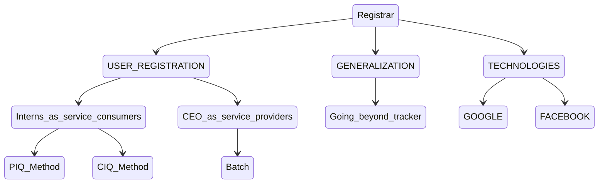

# Tracker

This is a system that will aid in tracking our daily activities and assignments.

## The Systems Objectives

1. To monitor assignments given to staff.
2. To keep records of all interns.
3. To monitor day to day operations.

(Tracker in relation to Registrar module)

In tracker application we intend to have three role players;The C.E.O of a
company,the staff and the developers of their systems.

## REGISTRAR AGENDA

# 1. USER REGISTRATION

## 1.1 C.E.O/SERVICE PROVIDER REGISTRATION 

### Proposal

1. Design a new model and add a relationship linking them to their applications
Add the C.E.O to the model.
 ## 1.1.1 BATCH

The C.E.O should be in a position to register.

- His organization.
- His developers.
- His staff.

## 1.2 INTERNS/SERVICE CONSUMER REGISTRATION

The interns in turn should be able to register.

- The organization they work for.
- The application they are currently working on.
- Their personal details.

`(Proposal)` 

1. Every developer(intern) should have an account in the tracker application in order
to.
- Receive payment
- Input tea expense receipts
2. Add a modules table.
3. Change from developer to intern

When registering a new intern, some of the questions to be asked are

- Their full name
- Mobile number
- Type of internship.
- Duration and the institution an intern is currently under
- Previous attachments
- Qualification
- Residence
- Reference[who referred you to this program ?]  

### 1.2.1 Picture Image Questionnaire(PIQ)

This is a logical flow of questions intended to be answered by the user.

### 1.2.2 Computer Aided Questionire(CAQ)
In CIQ, the user is guided by the computer when entering the data 

**B** `(22-02-2022)`

1. Design a Computer  Assisted Questionnaire (CAQ) individual html pages for the chart.(SW)
2. Ensure the class step is working correctly.(DK)
3. Design the user interface.(FN)

# 2. TECHNOLOGIES.
## 2.1 GOOGLE

## 2.2 FACEBOOK

 # 3. GENERALIZATION
### 3.1 Going_beyond_tracker

 ## ASSIGNMENTS

 ### (i) PIQ

 **A** `(22-2-2022)`

- [x] 1. Work out a logical order of the questions and sketch a flow chart of the login process.(Everyone)
- [x] 2. Design a chart (FN)
- [x] 3. Design a Paper Image Questionnaire (PIQ) from the chart.(JN)
- [x] 4. Data collection from the PIQ.(PK)

**B** `(1-3-2022)`

- [x] 1. Redesign the Paper Image Questionnaire (PIQ) (JK/SM).The Computer  Assisted Questionnaire (CAQ) should be derived from the PIQ
- [x] 2. Design a system that can read PIQ and display the sections(FN)

**C** `(8-3-2022)`

- [x] 1. Use a table for the Telephone[JK]
- [x] 2. Add a more button to all the tables[JK]
- [x] 3. Change the date selector to time selector[JK]

### (ii) Google
**A** `(15-02-2022)`

- [x] 1. Ways of authenticating oneself in order to login

   - Login with Google (DK)

**B** `(1-3-2022)`

- [ ] 1. Develop the google login(firebase in typscript) (DK)
- [ ] 2. Use the previous code(outlook) and see if it's possible to reuse it(DK)

### (ii) Facebook

1. Ways of authentication(Using Facebook)(PK)

### `(15-3-22)`

- [ ] 1.Document CRUD page(FN)
- [ ] Modify the library and add the organization to level 1 adm(C.E.O) (DK)
- [ ] Ensure any time you want to represent data to the db, you limit yourself to the organization(PK)
- [ ] Create level 2 registration(FN)
	Create a class(PIQ) that extends a baby
- [ ] Tables and Fields in the database should be similar(FN/JK)
